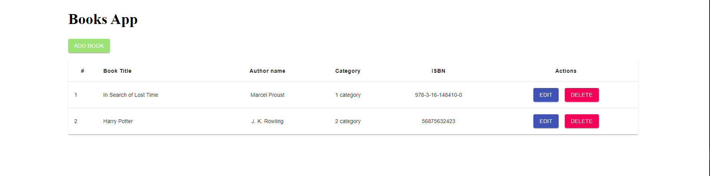

<!-- PROJECT LOGO -->


<h3 align="center">Books Application</h3>


<!-- ABOUT THE PROJECT -->
## About The Project

This is a books application. Books application can save books in fake database, editing and deleting them


### Built With

* [React](https://reactjs.org/)
* [Material UI](https://material-ui.com/)
* [React Hooks](https://reactjs.org/docs/hooks-reference.html)
* [React router dom](https://reactrouter.com/web/guides/quick-start)


<!-- GETTING STARTED -->
## Getting Started

This is an example of how you may give instructions on setting up your project locally.
To get a local copy up and running follow these simple example steps.

### Prerequisites

This is an example of how to list things you need to use the software and how to install them.

### Installation

1. Clone the repo
   ```sh
   git clone https://github.com/alex-borovikov/project_books_app_react.git
   ```
3. Install NPM packages. Go to the client folder
   ```sh
   npm install
   ```
   
4. Install NPM packages. Go to the JSONWEBSERVER folder: 
   ```sh
   npm install
   ```
4. Run fake server(in JSONWEBSERVER folder)
   ```sh
   npm run script
   ```
   
5. Run web app (in client folder)
    ```sh
    npm start
    ```


<!-- CONTACT -->
## Contact

Alex Borovykov - [@ozerov.live](https://instagram.com/ozerov.live) - alex.borrovikov@gmail.com

Project Link: [https://github.com/alex-borovikov/project_books_app_react.git](https://github.com/alex-borovikov/project_books_app_react.git)


